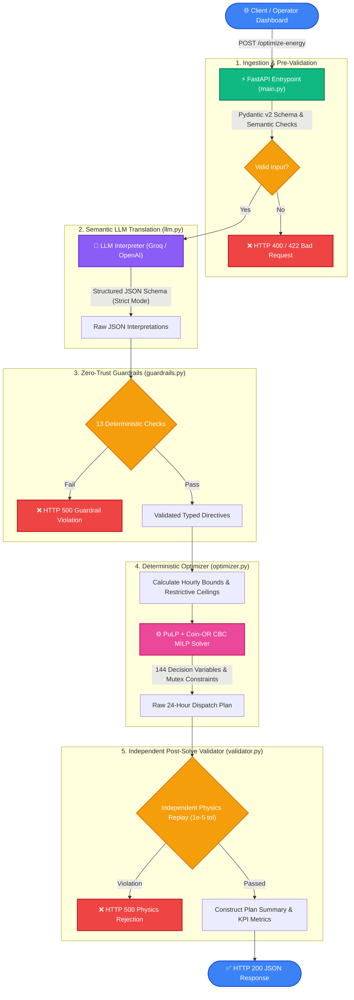

<div align="center">
<a href="https://github.com/nafisatabassumnusrat/GridWise">
  


###  AI-Assisted, Deterministically Validated MILP Microgrid Optimization Engine

[](https://www.python.org/)
[](https://fastapi.tiangolo.com/)
[](https://coin-or.github.io/pulp/)
[](https://react.dev/)
[](https://groq.com/)
[](https://www.docker.com/)
[](LICENSE)

**Team CISNEXUS • BUP CSE FEST 2026 Preliminary Round**

[Architecture](#-architecture) • [Quickstart](#-quickstart) • [LLM & Guardrails](#-llm--guardrails--optimizer-pipeline) • [Mathematical Model](#-optimization-formulation) • [API Reference](#-api-specification) • [Docker](#-docker-deployment) • [Frontend UI](#-interactive-web-dashboard)

</div>

---

## 📌 Executive Summary

Modern university campuses consume massive electrical loads supplied by a combination of rooftop solar photovoltaic (PV) arrays, battery energy storage systems (BESS), and the national utility grid with time-varying peak/off-peak tariffs. 

**GridWise** delivers an automated, cost-minimizing 24-hour energy dispatch plan while interpreting real-world, natural-language operational notes written by facility engineers.

### 🛡️ Why Pure LLMs & Pure Solvers Fail Alone
- **Pure Solvers** are blind to natural language: they cannot natively parse *"cut solar output by 30% from 11 AM to 2 PM for cleaning"* or *"hold 40 kWh battery reserve during evening peak"*.
- **Pure LLMs** are notorious for numerical hallucinations and cannot be trusted to perform exact arithmetic or enforce strict physical conservation laws.

**The GridWise Solution:** A strictly decoupled architecture where LLMs serve **only** for semantic comprehension and intent extraction, guarded by **13 deterministic zero-trust validation checks**, and feeding into a provably optimal **Mixed-Integer Linear Programming (MILP)** solver with an independent post-solve physics validator.

---

## 🏗️ Architecture



---

## ⚡ Core Features

- **Decoupled Intelligence**: LLM parses human intent into strict JSON; PuLP/CBC handles the deterministic mathematical optimization.
- **Multi-Provider LLM Engine**: Seamlessly toggle between **Groq** (ultra-fast inference via `openai/gpt-oss-120b` or `llama-3.3-70b-versatile`) and **OpenAI** (`gpt-4o`). Includes an offline regex mock for CI/CD.
- **13 Zero-Trust Guardrails**: Validates hour boundaries $[0, 23]$, sort order, uniqueness, solar factors $[0, 1]$, non-negative reserve limits, and mutual exclusivity.
- **Physical Feasibility Guarantee**: Post-solver replay checks hourly conservation of energy ($\Delta = 0$), battery capacity bounds, and end-of-day energy balance within $10^{-5}$ tolerance.
- **Executive Web Dashboard**: High-performance React 18 + Vite SPA styled with Tailwind CSS, glassmorphism aesthetics, interactive Recharts graphs, and real-time scenario simulation.

---

## 🚀 Quickstart

### Prerequisites
- **Python 3.12+**
- **Node.js 18+** & npm (for frontend)
- **Groq API Key** *(recommended)* or **OpenAI API Key**

### 1. Backend Setup

```bash
# Clone the repository
git clone https://github.com/Joy185c/bup_project.git
cd bup_project

# Create and activate virtual environment
python3 -m venv .venv
source .venv/bin/activate       # On Windows: .venv\Scripts\activate

# Install dependencies
pip install -r requirements.txt

# Configure environment variables
cp .env.example .env
```

Edit `.env` with your preferred API keys:
```ini
# Recommended: Groq for near-instant inference
LLM_PROVIDER=groq
GROQ_API_KEY=gsk_your_groq_api_key_here
LLM_MODEL=openai/gpt-oss-120b

# Or OpenAI
# LLM_PROVIDER=openai
# OPENAI_API_KEY=sk-proj-your_openai_key_here
# LLM_MODEL=gpt-4o

MOCK_LLM=false
LOG_LEVEL=INFO
```

### 2. Launch FastAPI Server

```bash
uvicorn app.main:app --host 0.0.0.0 --port 8000 --reload
```
* The API documentation will be available at [http://localhost:8000/docs](http://localhost:8000/docs).
* Health check endpoint: [http://localhost:8000/health](http://localhost:8000/health).

### 3. Frontend Web Dashboard Setup

```bash
cd frontend
npm install
npm run dev
```
Open [http://localhost:5173](http://localhost:5173) to access the interactive optimization UI.

---

## 🧪 Testing & Verification

Run the comprehensive automated test suite across guardrails, optimizer physics, and API contracts:

```bash
# Run all unit and integration tests
pytest -v

# Run individual test suites
pytest tests/test_guardrails.py -v   # Guardrail assertion checks
pytest tests/test_optimizer.py -v    # MILP bounds, tolerances & physics
pytest tests/test_api.py -v          # Full HTTP endpoint validation
```

Run test suite on official benchmark cases:
```bash
python evaluate_accuracy.py
```

---

## 📦 Docker Deployment

GridWise is fully containerized with the CBC branch-and-cut solver pre-installed.

### Build Image
```bash
docker build -t gridwise-energy-optimizer:latest .
```

### Run Container
Inject secrets at runtime; never bake API credentials into the image:
```bash
docker run -d -p 8000:8000 \
  -e LLM_PROVIDER=groq \
  -e GROQ_API_KEY="your_groq_api_key" \
  -e MOCK_LLM=false \
  --name gridwise-service \
  gridwise-energy-optimizer:latest
```

Verify service readiness:
```bash
curl http://localhost:8000/health
# {"status":"ok"}
```

---

## 🧠 LLM → Guardrails → Optimizer Pipeline

### 1. Supported Directives

The system deterministically maps natural-language operator instructions into one of six canonical directives:

| Directive Type | Mathematical Transformation | Example Note |
| :--- | :--- | :--- |
| `solar_reduction` | $\text{solar\_used}_h \le \text{solar}_h \times \text{factor}$ | *"Reduce solar panel output by 30% from 11 AM to 2 PM"* |
| `minimum_battery_reserve` | $E_h \ge \max(\text{base\_min}, \text{directive\_min})$ | *"Maintain at least 40 kWh in battery reserve between 6 PM and 9 PM"* |
| `no_charge_window` | $\text{charge}_h = 0$ | *"Do not charge the battery from 5 PM to 9 PM due to peak tariffs"* |
| `no_discharge_window` | $\text{discharge}_h = 0$ | *"Hold battery charge; do not discharge between 8 AM and 11 AM"* |
| `max_grid_window` | $\text{grid}_h \le \text{max\_grid\_kwh}$ | *"Cap grid import at 50 kWh between 2 PM and 5 PM"* |
| `no_op` | No constraint adjustment applied | *"Weather looks clear today; expect high baseline solar"* |

> **Note on Time Parsing**: All operational hours follow standard $24$-hour indices $[0, 23]$ with start-inclusive, end-exclusive boundaries (e.g., 11 AM to 2 PM $\rightarrow$ hours `[11, 12, 13]`).

### 2. Guardrails (13 Deterministic Checkpoints)
Prior to model synthesis, `app/guardrails.py` enforces:
1. Exact count parity: $|{\text{interpretations}}| = |{\text{operator\_notes}}|$
2. Sequential note index mapping without duplicates: $\{0, 1, \dots, N-1\}$
3. Directive type membership in canonical set $\mathcal{D}$
4. Hour bounds: $\forall h \in \text{hours}, h \in \{0, 1, \dots, 23\}$
5. Monotonic hour ordering: $h_0 < h_1 < \dots < h_k$
6. Unique hour sets (no internal duplicates)
7. Solar reduction factor bounds: $0.0 \le \text{factor} \le 1.0$
8. Finite float validation (rejection of `NaN`, `Inf`)
9. Battery reserve feasibility: $0 \le \text{reserve} \le \text{battery capacity}$
10. Non-negative grid import ceilings: $\text{max\_grid\_kwh} \ge 0$
11. Boolean consistency: `no_op` directives must have `applies=false`
12. Null-field cleanliness: unused adjustment fields must be strictly null
13. Conflict resolution: overlapping directives resolve to the most restrictive constraint

---

## 📐 Optimization Formulation

The dispatch optimization is formulated as a Mixed-Integer Linear Program (MILP) solved over a horizon of $T = 24$ hours ($h \in \{0, \dots, 23\}$).

### Objective Function
Minimize total grid electricity cost over the 24-hour dispatch cycle:
$$\min \sum_{h=0}^{23} \text{grid}_h \cdot \text{tariff}_h$$

### Decision Variables
| Variable | Type | Bounds | Description |
| :--- | :--- | :--- | :--- |
| $\text{grid}_h$ | Continuous | $[0, \infty)$ | Electrical energy imported from the utility grid in hour $h$ (kWh) |
| $\text{solar\_used}_h$ | Continuous | $[0, \text{effective\_solar}_h]$ | Solar generation utilized in hour $h$ (kWh) |
| $\text{charge}_h$ | Continuous | $[0, C_{\max}]$ | Energy charged into the battery in hour $h$ (kWh) |
| $\text{discharge}_h$ | Continuous | $[0, D_{\max}]$ | Energy discharged from the battery in hour $h$ (kWh) |
| $E_h$ | Continuous | $[E_{\min, h}, E_{\max}]$ | Battery state of charge (SoC) at the end of hour $h$ (kWh) |
| $b_h$ | Binary | $\{0, 1\}$ | Mutex indicator: $1$ if charging, $0$ if discharging |

### Constraints
1. **Hourly Energy Balance**:
   $$\text{grid}_h + \text{solar\_used}_h + \text{discharge}_h = \text{demand}_h + \text{charge}_h \quad \forall h$$
2. **Battery State of Charge Dynamics**:
   $$E_0 = E_{\text{initial}} + \text{charge}_0 - \text{discharge}_0$$
   $$E_h = E_{h-1} + \text{charge}_h - \text{discharge}_h \quad \forall h \in \{1, \dots, 23\}$$
3. **Mutual Exclusivity (No Simultaneous Charge & Discharge)**:
   $$\text{charge}_h \le C_{\max} \cdot b_h \quad \forall h$$
   $$\text{discharge}_h \le D_{\max} \cdot (1 - b_h) \quad \forall h$$
4. **End-of-Day Neutrality**:
   $$E_{23} = E_{\text{initial}}$$
   Ensures the facility does not deplete stored energy across consecutive operating days.

---

## 📡 API Specification

### `GET /health`
Returns service liveliness and operational readiness.

```json
{
  "status": "ok"
}
```

### `POST /optimize-energy`
Primary dispatch optimization endpoint.

#### Example Request:
```bash
curl -X POST http://localhost:8000/optimize-energy \
  -H "Content-Type: application/json" \
  -d @sample_request.json
```

```json
{
  "scenario_id": "campus-2024-weekday-01",
  "operator_notes": [
    "Reduce solar panel output by 30% from 11 AM to 2 PM due to maintenance.",
    "Maintain at least 40 kWh in the battery reserve from 6 PM to 9 PM.",
    "Do not charge the battery from 5 PM to 9 PM."
  ],
  "hours": [
    {"hour": 0, "demand_kwh": 45.0, "solar_kwh": 0.0, "tariff_bdt_per_kwh": 5.0},
    {"hour": 1, "demand_kwh": 40.0, "solar_kwh": 0.0, "tariff_bdt_per_kwh": 5.0}
  ],
  "battery": {
    "capacity_kwh": 200.0,
    "initial_energy_kwh": 100.0,
    "minimum_energy_kwh": 20.0,
    "max_charge_kwh_per_hour": 50.0,
    "max_discharge_kwh_per_hour": 50.0
  }
}
```

#### Example Response:
```json
{
  "scenario_id": "campus-2024-weekday-01",
  "directive_interpretation": [
    {
      "note_index": 0,
      "applies": true,
      "directive_type": "solar_reduction",
      "structured_adjustment": {
        "hours": [11, 12, 13],
        "factor": 0.7
      },
      "explanation": "30% reduction keeps 70% (factor=0.7) during hours 11, 12, 13."
    }
  ],
  "hourly_plan": [
    {
      "hour": 0,
      "grid_kwh": 45.0,
      "solar_used_kwh": 0.0,
      "battery_action": "idle",
      "battery_kwh": 0.0,
      "battery_energy_after_kwh": 100.0
    }
  ],
  "total_grid_kwh": 1420.5,
  "total_cost_bdt": 12850.0,
  "peak_grid_kwh": 95.0,
  "plan_summary": "Optimized 24-hour schedule honoring all 3 directives with 0 constraint violations."
}
```

---

## 🎨 Interactive Web Dashboard

The repository includes a modern React frontend located in `frontend/`:
- **Glassmorphism UI**: High-contrast, dark-mode themed interface designed for control-room operations.
- **Dynamic Telemetry Charts**: Stacked generation-versus-load visualization, battery SoC curve, and tariff rate overlays powered by Recharts.
- **Directives Inspector**: Live card breakdown of extracted operator constraints with status badges.
- **Scenario Simulator**: Test scenarios on the fly with real-time feedback.

```bash
# Launch frontend in development mode
cd frontend
npm run dev
```

---

## 📂 Project Structure

```
.
├── ARCHITECTURE.md          # Exhaustive systems & security architecture documentation
├── Dockerfile               # Production container definition (Debian + coinor-cbc + Python 3.12)
├── FRONTEND.md              # Frontend component hierarchy & build instructions
├── README.md                # Master repository documentation
├── api/                     # Serverless & Vercel deployment entrypoints
├── app/                     # Core backend package
│   ├── config.py            # Environment settings & LLM provider configurations
│   ├── guardrails.py        # 13 deterministic LLM validation checks
│   ├── llm.py               # Multi-provider LLM client (Groq / OpenAI)
│   ├── main.py              # FastAPI application endpoints & error handlers
│   ├── mock_llm.py          # Offline deterministic regex mock for testing
│   ├── optimizer.py         # PuLP MILP formulation & CBC solver integration
│   ├── schemas.py           # Pydantic v2 schemas and validation models
│   └── validator.py         # Independent physical feasibility replay engine
├── evaluate_accuracy.py     # Evaluation harness for official benchmark dataset
├── frontend/                # React 18 + Vite + Tailwind CSS SPA
│   ├── src/                 # Application components, charts, pages, & stores
│   └── package.json         # Frontend dependencies & scripts
├── package.json             # Root monorepo script coordinator
├── requirements.txt         # Production Python dependencies
├── sample_request.json      # Complete 24-hour test payload with 3 operator notes
├── test_data/               # Official challenge benchmark datasets
├── tests/                   # Pytest automated test suite
│   ├── test_api.py          # API endpoint contract tests
│   ├── test_guardrails.py   # Guardrail assertion tests
│   └── test_optimizer.py    # MILP model correctness tests
└── vercel.json              # Vercel deployment routing configuration
```

---

## 🔒 Security & Robustness

- **Zero Secret Ingestion**: API keys are read strictly from runtime environment variables; no credentials exist in Docker layers or Git history.
- **Deterministic Bounds**: Numerical solver operates with $10^{-5}$ tolerance (`FEASIBILITY_TOL`); outputs are rounded to 4 decimal places to prevent floating-point discrepancies.
- **Controlled Error Handling**: Exceptions inside solver or guardrail modules return clean, sanitized HTTP status codes without leaking internal server stack traces.

---

## 👥 Authors & Acknowledgments

Developed by **Team CISNEXUS** for the **BUP CSE FEST 2026** Hackathon Challenge (*GridWise Smart Campus Energy Optimization*).
